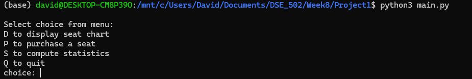
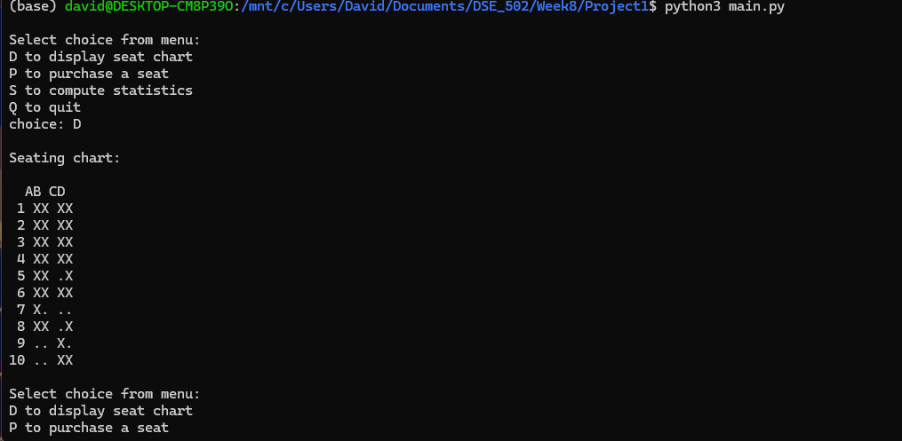
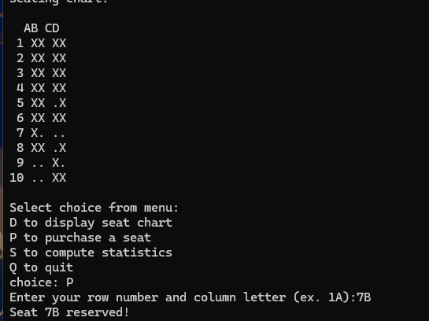
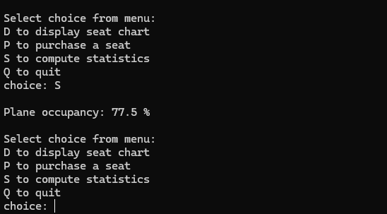

# Airplane Seat Booking System
Interactive Python application for viewing, reserving, and managing airplane seats using file I/O and data structures.

---

## Overview

The program stores airplane seating information in a text file and allows users to:

- Display the current seats
- Reserve available seats
- Prevent duplicate reservations
- Calculate seat occupancy statistics
- Save updated seat assignments to a file

---

## Skills Demonstrated

- Python programming
- Functions
- Lists (2D lists)
- File input/output
- Data structures
- User input validation
- Error handling
- Modular programming

---

## Project Files

- **src/main.py** – Main Python program
- **data/seats.txt** – Airplane seat layout used by the program

---

## Running the Program

Run `main.py` from the `src` folder.

The program will load the seating information from `data/seats.txt`.

## Example Features

- Display the seating chart
- Reserve an available seat
- Validate row and seat selections
- Prevent booking occupied seats
- Calculate the percentage of occupied seats
- Save seat reservations for future sessions

  ## What I Learned

  - Reading and writing text files
  - Designing  modular Python programs using functions
  - Working with 2D lists
  - Validating user input
  - Creating menu-driven console applications
  - Organizing Python projects using GitHub
 
  ---

## Program Preview

### Main Menu

### Seating Chart

### Seat Reservation

### Occupancy Statistics

---

  ## Future Improvements

  - Graphical user interface (GUI)
  - Automatic seat recommendations
  - Multiple airplane layouts
  - Passenger information and ticket management
  - Database storage instead of text files
 
  ## Author

  **David Prochaska**

  M.S. Bioinformatics Student
  University of Maine
  
